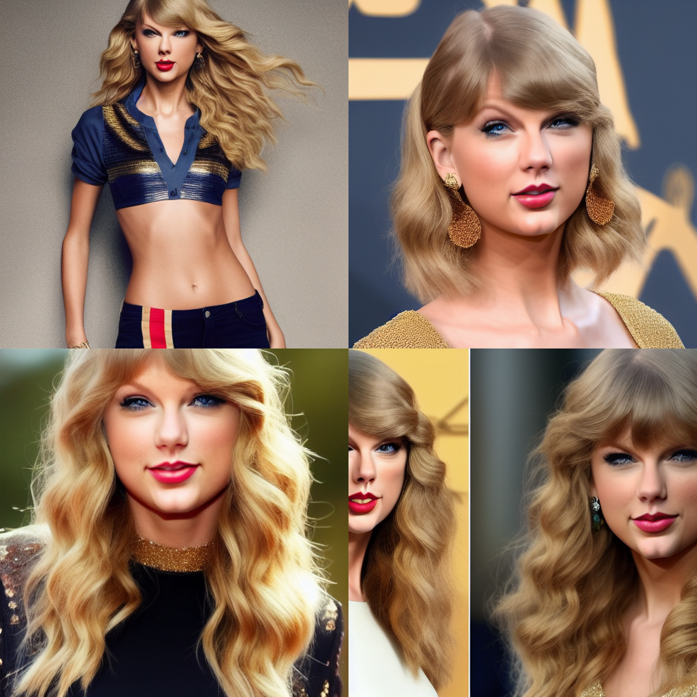

# BeautifulPrompt

## 简介 Brief Introduction

我们开源了一个自动Prompt生成模型，您可以直接输入一个极其简单的Prompt，就可以得到经过语言模型优化过的Prompt，帮助您更简单地生成高颜值图像。

We release an automatic Prompt generation model, you can directly enter an extremely simple Prompt and get a Prompt optimized by the language model to help you generate more beautiful images simply.

* Github: [EasyNLP](https://github.com/alibaba/EasyNLP)

## 使用 Usage

```python
from transformers import AutoTokenizer, AutoModelForCausalLM

tokenizer = AutoTokenizer.from_pretrained('alibaba-pai/pai-bloom-1b1-text2prompt-sd')
model = AutoModelForCausalLM.from_pretrained('alibaba-pai/pai-bloom-1b1-text2prompt-sd').eval().cuda()

raw_prompt = '1 girl'
input = f'Instruction: Give a simple description of the image to generate a drawing prompt.\nInput: {raw_prompt}\nOutput:'
input_ids = tokenizer.encode(input, return_tensors='pt').cuda()

outputs = model.generate(
    input_ids,
    max_length=384,
    do_sample=True,
    temperature=1.0,
    top_k=50,
    top_p=0.95,
    repetition_penalty=1.2,
    num_return_sequences=5)

prompts = tokenizer.batch_decode(outputs[:, input_ids.size(1):], skip_special_tokens=True)
prompts = [p.strip() for p in prompts]
print(prompts)
```

## 作品展示 Gallery

<style>
table th:first-of-type {
    width: 50%;
}
table th:nth-of-type(2) {
    width: 50%;
}
</style>

| Original | BeautifulPrompt |
| ---------------------------------------- | ---------------------------------- |
| prompt: taylor swift, country, golden, fearless,wavehair | prompt: portrait of taylor swift as a beautiful woman, long hair, country, golden ratio, intricate, symmetrical, cinematic lighting, highly detailed, digital painting, artstation, concept art, smooth, sharp focus, illustration |
|                         |                   |


| Original | BeautifulPrompt |
| ---------------------------------------- | ---------------------------------- |
| prompt: A majestic sailing ship | prompt: a massive sailing ship, epic, cinematic,    artstation, greg rutkowski, james gurney, sparth |
|                         |                   |


## 使用须知 Notice for Use

使用上述模型需遵守[AIGC模型开源特别条款](https://terms.alicdn.com/legal-agreement/terms/common_platform_service/20230505180457947/20230505180457947.html)。

If you want to use this model, please read this [document](https://terms.alicdn.com/legal-agreement/terms/common_platform_service/20230505180457947/20230505180457947.html) carefully and abide by the terms.
